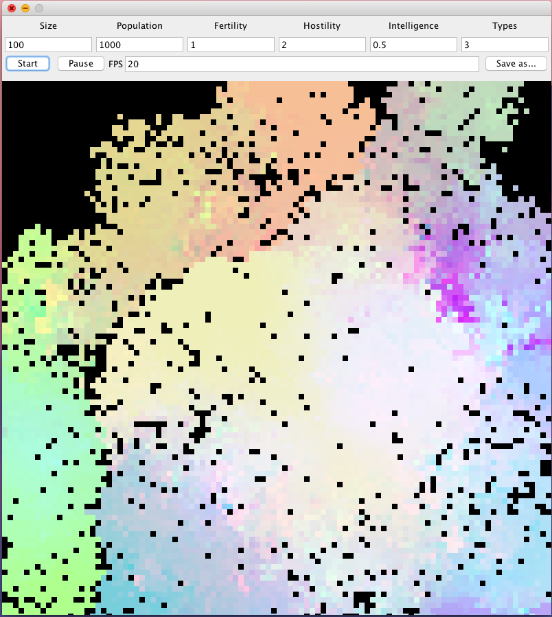

# The Pixel Simulator
###### Artur Upton Renault

This project is meant to be a pretty simple simulation of living creatures in
 general, a topic we discussed at length in **RELIW4815 Technology Religion 
 Future** taught by David Kittay. This simulation is not meant to be 
 completely accurate; it's meant to be a simplified abstraction of our world 
 and hopes to gain some insight into our reality and into simulations in 
 general.

## How it works

This simulation takes the form of a 2D grid. Each cell in the grid has a 
value from 0 to 1 called hostility; this value is an abstraction of all the 
natural features of that part of the land. Higher hostility values mean it is
 more difficult for life to thrive there.
 
This world is inhabited by creatures, each of which occupies one cell in the 
grid. Each creature is assigned to a type, which is simply a number; 
creatures of the same type are friendly, while creatures of different types are
 enemies. This was chosen as a simplistic way to create conflict and 
 competition among creatures. 

These creatures have three attributes, each of which is held as a value
 between 0 and 1:

- Strength: determines how likely a creature is to survive the hostility of 
the environment, and how likely it is to defeat an enemy creature in a fight.

- Fertility: determines how likely a creature is to successfully reproduce 
with a friendly creature.

- Intelligence: supplements both strength and fertility.

Creatures are initially created with random values for each of their 
attributes and randomly assigned a type.

The empty world is displayed as a black screen. Creatures are displayed 
as squares in the simulator, with their RGB values derived from their 
attributes: red is strength, green is fertility, and blue is intelligence. 
Thus, a creature with perfect strength, fertility, and intelligence would be 
white.

On each turn, the simulation performs the following in order to each creature:

1. Determine if the creature gets killed by the hostility of the environment 
(strength vs hostility)
2. Handle the creature's interactions with each of its neighbors:
    - if the neighbor is friendly, it tries to reproduce with it. (strength 
    vs strength)
    - if the neighbor is an enemy, it tries to kill it. (fertility)
3. If there is a less hostile cell near the creature, the creature moves there.

All these events are determined by generating random numbers with the 
relevant attribute as the maximum (effectively rolling dice).

When two creatures reproduce, the offspring has the same type as its parents.
 The value of each of its attributes is drawn from a normal distribution; the 
 mean of the distribution is the mean of the parents' values, and the 
 standard deviation is half the difference between them. This is meant to be 
 a simple replication of inheritance, taking into account the parents' 
 "genes," but allowing for random mutation.

## How to use

### Start it up
#### Option 1: The technical solution
1. Compile:
`javac Simulator.java`
2. Run:
`java Simulator`

#### Option 2: 
Hit me up, and I'll send you an executable that you can just click to run.

When run, the following window will open:

### The Simulator Window

#### Size
The width of the square simulator world. Works with values 1-800. Keep in 
mind that high values for this will make the simulator very slow.

#### Population
How many creatures the simulator will start off with. Use big numbers here; 
many creatures die in the very beginning.

#### Fertility
A factor of how easy it will be to reproduce in the simulation. A value of 2 
makes it twice as easy, a value of 0.5 makes it twice as hard.

#### Hostility
Adjusts the hostility of the simulation as a whole. While the exact values 
will vary across different parts of the board, a value of 2 for hostility 
will make it twice as hard for the creatures to survive.

#### Intelligence
Adjusts how much intelligence supplements fertility and hostility. A value of
 2 makes intelligence worth twice as much as the other two, while 0.5 will 
 make it half as valuable.
 
#### Types
Determines how many different types of creatures will be in the simulation. 
Remember that creatures of the same type are friendly while those of 
different types are enemies; therefore simulations with more types are likely
 to have more conflicts.
 
#### Start
Starts a new simulation with the configuration in the fields above.

#### Pause
Pauses a simulation if it is not already paused; continues it if it is paused
. Unpausing a simulation will not change its configurations.

#### FPS
Adjusts the speed of the simulation. The FPS of a simulation can be changed 
after it is started by changing the value after pausing the simulation, and 
then unpausing it.

#### Save as...
Opens up a dialog allowing you to save a screenshot of the simulation. 
Probably pause the simulation before using this.

## Acknowledgements

Thank you to the authors of libgdx, specifically Mario Zechner and Nathan 
Sweet, for writing a smooth noise generator and keeping it open under the 
Apache license. I used their method to randomly generate a smooth hostility 
field for my environment.

Thank you to Nick Bostrum, Hans Moravec, Robin Hanson, and other authors whom
 we read for this class, and who greatly inspired our discussion and this 
 project.

Thank you to Professor Kittay and the members of the Technology Religion 
Future class for the fantastic discussion this semester, in and out of class.
 No class has challenged my thinking as much as this one, and I hope that 
 we'll remember each other many years from now when we are computer programs 
 living off test-tube meat.
